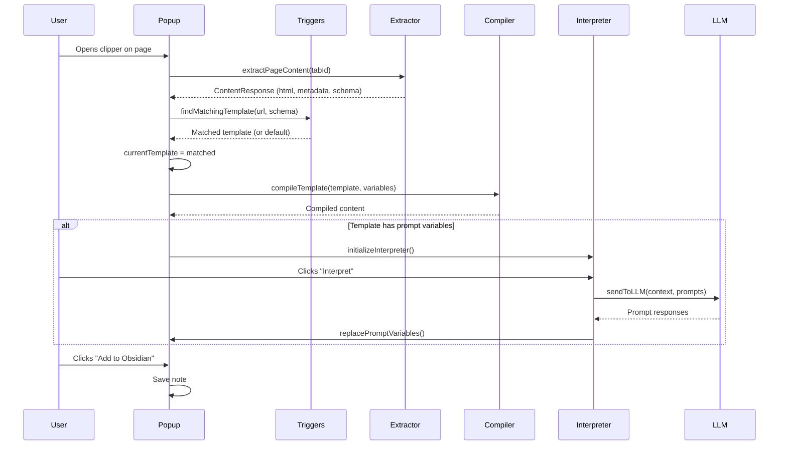
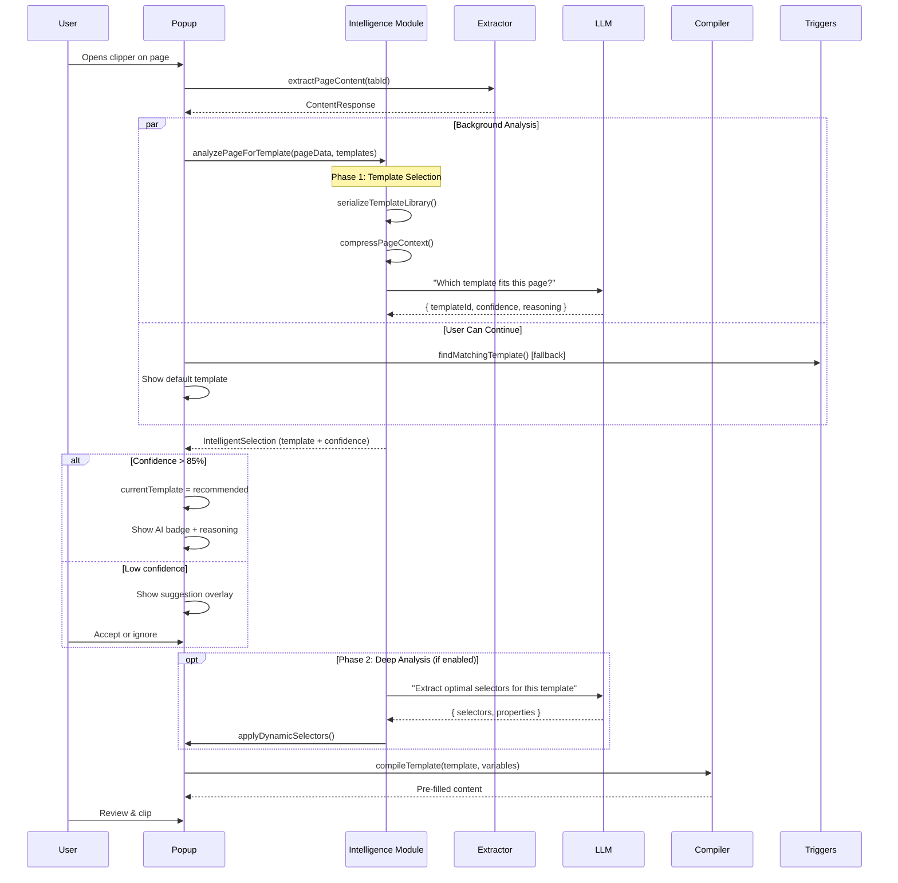

# Intelligent Interpreter: Technical Flow Diagrams

This document provides visual references for the architectural flows described in the research report.

---

## Current Architecture Flow



---

## Proposed Two-Phase Architecture



---

## Data Flow: Template Intelligence Module

```
┌─────────────────────────────────────────────────────────┐
│               Intelligence Module Input                  │
├─────────────────────────────────────────────────────────┤
│                                                           │
│  ┌────────────────┐      ┌──────────────────┐          │
│  │  Page Content  │      │ Template Library │          │
│  ├────────────────┤      ├──────────────────┤          │
│  │ • HTML         │      │ • Templates[]    │          │
│  │ • Title        │      │ • Metadata       │          │
│  │ • Schema.org   │      │ • Descriptions   │          │
│  │ • Word count   │      │ • Examples       │          │
│  │ • DOM outline  │      │ • Triggers       │          │
│  └────────────────┘      └──────────────────┘          │
│           │                       │                      │
│           └───────────┬───────────┘                      │
│                       ▼                                  │
│              ┌─────────────────┐                        │
│              │  serializeForAI  │                        │
│              └─────────────────┘                        │
│                       │                                  │
└───────────────────────┼──────────────────────────────────┘
                        ▼
┌─────────────────────────────────────────────────────────┐
│                    LLM Analysis                          │
├─────────────────────────────────────────────────────────┤
│                                                           │
│  System Prompt: "You are a content analyzer..."         │
│                                                           │
│  Input Context (~3000 tokens):                           │
│  ┌──────────────────────────────────────────┐           │
│  │ Page: {                                   │           │
│  │   type: "webpage",                        │           │
│  │   title: "Neural Networks Review",       │           │
│  │   schema: "ScholarlyArticle",             │           │
│  │   sections: ["abstract", "methods"...],   │           │
│  │   wordCount: 8500                         │           │
│  │ }                                          │           │
│  │                                            │           │
│  │ Templates: [                               │           │
│  │   {id: "academic", desc: "Research...",    │           │
│  │    properties: ["authors", "doi"]},        │           │
│  │   {id: "blog", desc: "Casual...",          │           │
│  │    properties: ["tags", "mood"]}           │           │
│  │ ]                                          │           │
│  └──────────────────────────────────────────┘           │
│                       │                                  │
│                       ▼                                  │
│              ┌─────────────────┐                        │
│              │  LLM Processing  │                        │
│              └─────────────────┘                        │
│                       │                                  │
└───────────────────────┼──────────────────────────────────┘
                        ▼
┌─────────────────────────────────────────────────────────┐
│              Intelligence Module Output                  │
├─────────────────────────────────────────────────────────┤
│                                                           │
│  IntelligentSelection {                                  │
│    recommendedTemplate: Template {                       │
│      id: "academic-paper",                               │
│      name: "Academic Paper"                              │
│    },                                                    │
│    confidence: 0.94,                                     │
│    reasoning: "This is clearly a research article...",   │
│    suggestedSelectors: {                                 │
│      "abstract": "section.abstract",                     │
│      "methodology": "#methods"                           │
│    },                                                    │
│    suggestedProperties: [                                │
│      { name: "authors", value: "Smith, J.; Doe, A." },   │
│      { name: "field", value: "ML" }                      │
│    ],                                                    │
│    alternativeTemplates: [                               │
│      { id: "blog-post", confidence: 0.23 }               │
│    ]                                                     │
│  }                                                       │
│                                                           │
└─────────────────────────────────────────────────────────┘
```

---

## State Diagram: User Interaction Modes

```
                    ┌──────────────────┐
                    │  User Opens      │
                    │  Clipper         │
                    └────────┬─────────┘
                             │
                ┌────────────┴────────────┐
                │                         │
      ┌─────────▼─────────┐     ┌────────▼────────┐
      │  Mode: Automatic  │     │  Mode: Suggest  │
      │  (instant apply)  │     │  (user review)  │
      └─────────┬─────────┘     └────────┬────────┘
                │                        │
                │ Analysis runs          │ Analysis runs
                │ in background          │ in background
                │                        │
                ▼                        ▼
      ┌──────────────────┐    ┌────────────────────┐
      │ Confidence > 85%? │    │ Show suggestion    │
      └────┬───────┬──────┘    │ overlay with       │
           │       │           │ reasoning          │
      Yes  │       │  No       └────────┬───────────┘
           │       │                    │
           ▼       ▼                    ▼
      ┌─────────────────┐    ┌────────────────────┐
      │ Auto-apply      │    │ User choice:       │
      │ recommended     │    │ • Accept           │
      │ template        │    │ • Ignore           │
      │                 │    │ • Regenerate       │
      │ Show AI badge   │    │ • Manual select    │
      └────────┬────────┘    └────────┬───────────┘
               │                      │
               └──────────┬───────────┘
                          │
                          ▼
              ┌────────────────────────┐
              │  Template Applied      │
              │                        │
              │  Optional Phase 2:     │
              │  • Dynamic selectors   │
              │  • Pre-fill properties │
              └────────┬───────────────┘
                       │
                       ▼
              ┌────────────────────────┐
              │  User Reviews Content  │
              └────────┬───────────────┘
                       │
                       ▼
              ┌────────────────────────┐
              │  Clip to Obsidian      │
              └────────────────────────┘
```

---

## Component Architecture

```
┌─────────────────────────────────────────────────────────────┐
│                        Frontend (Popup)                      │
├─────────────────────────────────────────────────────────────┤
│                                                               │
│  ┌──────────────┐  ┌──────────────┐  ┌──────────────────┐  │
│  │ Template     │  │ Intelligent  │  │ Interpreter      │  │
│  │ Dropdown     │  │ Selection    │  │ Section          │  │
│  │              │  │ Reasoning    │  │                  │  │
│  │ [Current UI] │  │ Panel [NEW]  │  │ [Existing]       │  │
│  └──────┬───────┘  └──────┬───────┘  └────────┬─────────┘  │
│         │                 │                   │             │
└─────────┼─────────────────┼───────────────────┼─────────────┘
          │                 │                   │
          ▼                 ▼                   ▼
┌─────────────────────────────────────────────────────────────┐
│                     Core Logic Layer                         │
├─────────────────────────────────────────────────────────────┤
│                                                               │
│  ┌────────────────────────────────────────────────┐         │
│  │  src/core/popup.ts                             │         │
│  │  ┌──────────────────────────────────────────┐ │         │
│  │  │ refreshFields() [MODIFIED]                │ │         │
│  │  │   ├─ Check intelligentMode enabled        │ │         │
│  │  │   ├─ Call analyzePageForTemplate()        │ │         │
│  │  │   ├─ Apply intelligent selection          │ │         │
│  │  │   └─ Fallback to trigger system           │ │         │
│  │  └──────────────────────────────────────────┘ │         │
│  └────────────────────────────────────────────────┘         │
│                                                               │
│  ┌────────────────────────────────────────────────┐         │
│  │  src/utils/interpreter-intelligence.ts [NEW]  │         │
│  │  ┌──────────────────────────────────────────┐ │         │
│  │  │ analyzePageForTemplate()                  │ │         │
│  │  │ generateDynamicSelectors()                │ │         │
│  │  │ serializeTemplateLibrary()                │ │         │
│  │  │ applyDynamicSelectors()                   │ │         │
│  │  │ evaluateTemplateMatch()                   │ │         │
│  │  └──────────────────────────────────────────┘ │         │
│  └────────────────────────────────────────────────┘         │
│                                                               │
└───────────────────────────┬───────────────────────────────────┘
                            │
                            ▼
┌─────────────────────────────────────────────────────────────┐
│                   Existing Modules (Enhanced)                │
├─────────────────────────────────────────────────────────────┤
│                                                               │
│  ┌──────────────────┐  ┌──────────────────┐                │
│  │ interpreter.ts   │  │ triggers.ts      │                │
│  │                  │  │                  │                │
│  │ • sendToLLM()    │  │ • findMatching   │                │
│  │   [REUSED]       │  │   Template()     │                │
│  │                  │  │   [FALLBACK]     │                │
│  └──────────────────┘  └──────────────────┘                │
│                                                               │
│  ┌──────────────────┐  ┌──────────────────┐                │
│  │ template-        │  │ content-         │                │
│  │ compiler.ts      │  │ extractor.ts     │                │
│  │                  │  │                  │                │
│  │ • compile        │  │ • extractPage    │                │
│  │   Template()     │  │   Content()      │                │
│  │   [ENHANCED]     │  │   [EXISTING]     │                │
│  └──────────────────┘  └──────────────────┘                │
│                                                               │
└─────────────────────────────────────────────────────────────┘
```

---

## Settings Integration

```
Settings Page
├─ General Settings
├─ Templates
├─ Interpreter
│   ├─ Enable Interpreter [existing]
│   ├─ Auto-run [existing]
│   ├─ Default Context [existing]
│   ├─ Models [existing]
│   ├─ Providers [existing]
│   │
│   └─ [NEW] Intelligent Selection
│       ├─ ☑ Enable intelligent template selection
│       ├─ Mode: [ Suggest & Review ▼ ]
│       │   • Always apply automatically
│       │   • Suggest & review (recommended)
│       │   • Manual trigger only
│       ├─ ☑ Show reasoning panel
│       ├─ ☑ Generate dynamic selectors
│       ├─ Confidence threshold: [85%] (slider)
│       └─ Template analysis model: [ GPT-4o-mini ▼ ]
│
└─ Advanced
```

---

## Error Handling & Fallback Chain

```
┌─────────────────────────────────────────┐
│  User Opens Clipper                     │
└─────────────────┬───────────────────────┘
                  │
                  ▼
         ┌────────────────────┐
         │ Intelligence Mode  │
         │ Enabled?           │
         └────┬──────────┬────┘
              │          │
         Yes  │          │  No
              │          └────────────────┐
              ▼                           │
    ┌──────────────────┐                 │
    │ Start AI         │                 │
    │ Analysis         │                 │
    └────┬──────────┬──┘                 │
         │          │                    │
    Success  Timeout/Error               │
         │          │                    │
         ▼          ▼                    │
    ┌─────────┐  ┌────────────┐         │
    │ Apply   │  │ Log error  │         │
    │ Result  │  │ Show toast │         │
    └────┬────┘  └─────┬──────┘         │
         │             │                 │
         │             ▼                 │
         │    ┌──────────────────┐      │
         │    │ FALLBACK 1:      │      │
         │    │ Trigger System   │◄─────┘
         │    └────┬──────────┬──┘
         │         │          │
         │    Success    No Match
         │         │          │
         │         ▼          ▼
         │    ┌─────────┐  ┌──────────────┐
         │    │ Use     │  │ FALLBACK 2:  │
         │    │ Matched │  │ First/Default│
         │    │ Template│  │ Template     │
         │    └────┬────┘  └──────┬───────┘
         │         │              │
         └─────────┴──────────────┘
                   │
                   ▼
         ┌──────────────────────┐
         │ Proceed with         │
         │ Selected Template    │
         └──────────────────────┘

Result: User ALWAYS gets a working template
        Intelligence is enhancement, not dependency
```

---

## Performance Optimization Strategy

```
┌──────────────────────────────────────────────────────┐
│            Page Load Performance                      │
├──────────────────────────────────────────────────────┤
│                                                        │
│  Time: 0ms                                            │
│  ┌─────────────────────────────────────────┐         │
│  │ User Opens Clipper                      │         │
│  │ • Render UI immediately                 │         │
│  │ • Show loading state                    │         │
│  │ • Apply fallback template               │         │
│  └─────────────────────────────────────────┘         │
│                                                        │
│  Time: 50ms (parallel)                                │
│  ┌─────────────────────┐ ┌────────────────────┐     │
│  │ Extract Page        │ │ Start AI Analysis  │     │
│  │ Content             │ │ (background)       │     │
│  │ • DOM scraping      │ │ • Serialize data   │     │
│  │ • Schema.org        │ │ • Build request    │     │
│  └─────────────────────┘ └────────────────────┘     │
│                                                        │
│  Time: 100ms                                          │
│  ┌─────────────────────────────────────────┐         │
│  │ Populate UI with Fallback Template      │         │
│  │ • User can edit immediately             │         │
│  │ • Show "Analyzing..." badge             │         │
│  └─────────────────────────────────────────┘         │
│                                                        │
│  Time: 2000-5000ms                                    │
│  ┌─────────────────────────────────────────┐         │
│  │ AI Analysis Complete                    │         │
│  │ • Show suggestion overlay               │         │
│  │ • User clicks "Apply" or ignores        │         │
│  └─────────────────────────────────────────┘         │
│                                                        │
│  Perceived Load Time: ~100ms (feels instant)         │
│  Actual Intelligence: Background enhancement          │
│                                                        │
└──────────────────────────────────────────────────────┘

Caching Strategy:
┌─────────────────────────────────────────┐
│ Cache Key: domain + schemaType          │
├─────────────────────────────────────────┤
│                                          │
│  Example:                                │
│  "arxiv.org:ScholarlyArticle"           │
│    → Template: "academic-paper"          │
│    → Confidence: 0.95                    │
│    → TTL: 30 days                        │
│                                          │
│  "medium.com:Article"                    │
│    → Template: "blog-post"               │
│    → Confidence: 0.88                    │
│    → TTL: 30 days                        │
│                                          │
│  Result: Instant selection for          │
│          repeat domains!                 │
│                                          │
└─────────────────────────────────────────┘
```

---

## Cost Analysis Breakdown

```
Per-Request Token Usage:

┌──────────────────────────────────────────────┐
│ INPUT TOKENS                                  │
├──────────────────────────────────────────────┤
│                                               │
│  System Prompt:               ~300 tokens    │
│  ├─ Role definition                          │
│  ├─ Output format spec                       │
│  └─ Constraints                              │
│                                               │
│  Template Library:           ~800-1200       │
│  ├─ 10 templates × 80-120 tokens each        │
│  │   - Name, description, properties         │
│  │   - Example triggers                      │
│  └─ JSON structure overhead                  │
│                                               │
│  Page Context:               ~500-1500       │
│  ├─ Compressed HTML outline                  │
│  ├─ Title, meta, schema.org                  │
│  └─ Section headers                          │
│                                               │
│  TOTAL INPUT:               ~1600-3000       │
│                                               │
├──────────────────────────────────────────────┤
│ OUTPUT TOKENS                                 │
├──────────────────────────────────────────────┤
│                                               │
│  Response JSON:              ~200-400        │
│  ├─ Template selection                       │
│  ├─ Confidence score                         │
│  ├─ Reasoning (2-3 sentences)                │
│  ├─ Suggested selectors (3-5)                │
│  └─ Suggested properties (2-5)               │
│                                               │
└──────────────────────────────────────────────┘

Cost per Request (GPT-4o-mini):
┌──────────────────────────────────────────────┐
│ Input:  2000 × $0.15 / 1M = $0.0003         │
│ Output:  300 × $0.60 / 1M = $0.0002         │
│ ─────────────────────────────────────────────│
│ TOTAL:                      $0.0005          │
└──────────────────────────────────────────────┘

Monthly Cost Scenarios:
┌────────────────────────────────────────────┐
│ Light User (20 clips/month):               │
│   20 × $0.0005 = $0.01/month               │
│                                             │
│ Regular User (100 clips/month):            │
│   100 × $0.0005 = $0.05/month              │
│                                             │
│ Power User (500 clips/month):              │
│   500 × $0.0005 = $0.25/month              │
│                                             │
│ With 50% cache hit rate:                   │
│   500 × 0.5 × $0.0005 = $0.125/month       │
│                                             │
│ Conclusion: Negligible cost for most users │
└────────────────────────────────────────────┘
```

---

## Learning & Improvement Loop

```
┌──────────────────────────────────────────────────────┐
│                 Continuous Learning                   │
└───────────────────────┬──────────────────────────────┘
                        │
        ┌───────────────┴───────────────┐
        │                               │
        ▼                               ▼
┌─────────────────┐           ┌─────────────────────┐
│ AI Suggests     │           │ User Makes Override │
│ Template X      │           │ Selects Template Y  │
│ (Confidence 88%)│           │                     │
└────────┬────────┘           └──────────┬──────────┘
         │                               │
         └───────────────┬───────────────┘
                         │
                         ▼
              ┌──────────────────────┐
              │ Log Override Event   │
              │                      │
              │ {                    │
              │   domain,            │
              │   schemaType,        │
              │   aiChoice,          │
              │   userChoice,        │
              │   pageFeatures       │
              │ }                    │
              └──────────┬───────────┘
                         │
                         ▼
              ┌──────────────────────┐
              │ Analysis Engine      │
              │                      │
              │ If overrides > 3     │
              │ for same pattern:    │
              │                      │
              │ • Update local cache │
              │ • Adjust system      │
              │   prompt hints       │
              │ • Improve template   │
              │   descriptions       │
              └──────────┬───────────┘
                         │
                         ▼
              ┌──────────────────────┐
              │ Improved Accuracy    │
              │                      │
              │ Next time same       │
              │ pattern appears:     │
              │ → Select Template Y  │
              │ → Higher confidence  │
              └──────────────────────┘

Pattern Recognition Example:
┌────────────────────────────────────────────┐
│ Domain: github.com                         │
│ Schema: SoftwareSourceCode                 │
│                                             │
│ Iteration 1: AI suggests "article"         │
│             User overrides to "code-repo"  │
│                                             │
│ Iteration 2: AI suggests "article"         │
│             User overrides to "code-repo"  │
│                                             │
│ Iteration 3: AI suggests "article"         │
│             User overrides to "code-repo"  │
│                                             │
│ → Pattern detected!                        │
│   Store: github.com + SoftwareSourceCode   │
│          → "code-repo" template            │
│                                             │
│ Iteration 4+: AI directly suggests         │
│               "code-repo" (learned!)       │
└────────────────────────────────────────────┘
```

---

**Visual References Complete**

These diagrams supplement the main research report and provide clear visual understanding of:
1. Current vs. proposed data flows
2. Component architecture changes
3. User interaction patterns
4. Performance optimization strategies
5. Cost breakdown
6. Learning mechanisms

Use these diagrams during implementation to maintain architectural clarity and ensure all team members understand the system design.
