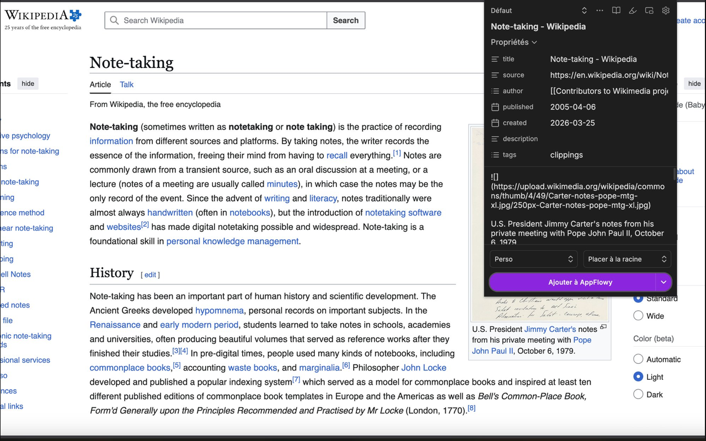
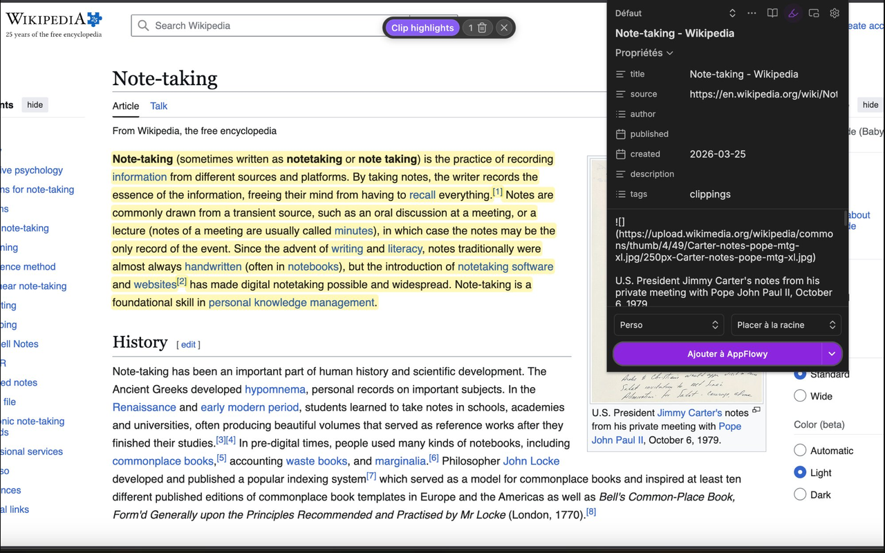
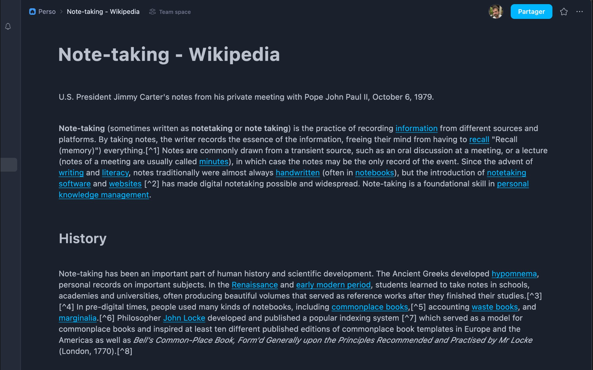
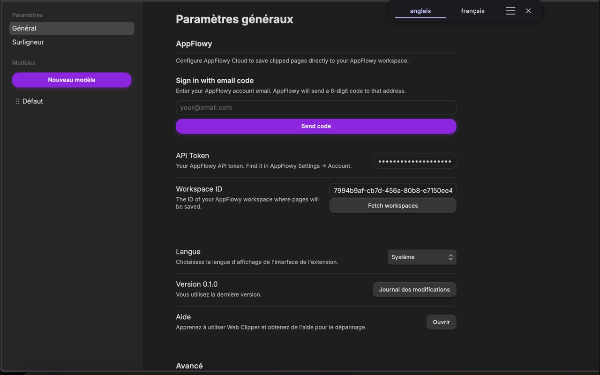

<p align="center">
  
</p>

# Clipper for AppFlowy

> A community fork of [obsidian-clipper](https://github.com/obsidianmd/obsidian-clipper), adapted for [AppFlowy](https://github.com/AppFlowy-IO/AppFlowy).

> ⚠️ This is an unofficial community project, not affiliated with or endorsed by the AppFlowy team.

[](LICENSE)

## Screenshots

<p align="center">
  
  
</p>
<p align="center">
  
  
</p>

## Get started

Download the latest release for your browser:

| Browser           | Download                                                                                                             |
| ----------------- | -------------------------------------------------------------------------------------------------------------------- |
| Chrome / Chromium | [clipper-for-appflowy-0.1.0-chrome.zip](https://github.com/alexrosepizant/clipper-for-appflowy/releases/tag/v0.1.0)  |
| Firefox           | [clipper-for-appflowy-0.1.0-firefox.zip](https://github.com/alexrosepizant/clipper-for-appflowy/releases/tag/v0.1.0) |
| Safari            | [clipper-for-appflowy-0.1.0-safari.zip](https://github.com/alexrosepizant/clipper-for-appflowy/releases/tag/v0.1.0)  |

Once downloaded, install it locally by following the [developer instructions](#install-the-extension-locally) below.

## Use the extension

Documentation is available in the [`docs/`](./docs) folder, covering how to use [highlighting](./docs/Highlight%20web%20pages.md), [templates](./docs/Templates.md), [variables](./docs/Variables.md), [filters](./docs/Filters.md), and more.

## Contribute

### Translations

You can help translate Clipper for AppFlowy into your language. Submit your translation via pull request using the format found in the [/\_locales](/src/_locales) folder.

### Features and bug fixes

See the [issues](https://github.com/alexrosepizant/clipper-for-appflowy/issues) for open tasks where contributions are welcome. Feel free to **[report a bug or request a feature](https://github.com/alexrosepizant/clipper-for-appflowy/issues)** as well.

## Developers

To build the extension:

```
npm run build
```

This will create three directories:

- `dist/` for the Chromium version
- `dist_firefox/` for the Firefox version
- `dist_safari/` for the Safari version

### Install the extension locally

For Chromium browsers, such as Chrome, Brave, Edge, and Arc:

1. Open your browser and navigate to `chrome://extensions`
2. Enable **Developer mode**
3. Click **Load unpacked** and select the `dist` directory

For Firefox:

1. Open Firefox and navigate to `about:debugging#/runtime/this-firefox`
2. Click **Load Temporary Add-on**
3. Navigate to the `dist_firefox` directory and select the `manifest.json` file

If you want to run the extension permanently you can do so with the Nightly or Developer versions of Firefox.

1. Type `about:config` in the URL bar
2. In the Search box type `xpinstall.signatures.required`
3. Double-click the preference, or right-click and select "Toggle", to set it to `false`.
4. Go to `about:addons` > gear icon > **Install Add-on From File…**

For iOS Simulator testing on macOS:

1. Run `npm run build` to build the extension
2. Open `xcode/Clipper for AppFlowy/Clipper for AppFlowy.xcodeproj` in Xcode
3. Select the **Clipper for AppFlowy (iOS)** scheme from the scheme selector
4. Choose an iOS Simulator device and click **Run** to build and launch the app
5. Once the app is running on the simulator, open **Safari**
6. Navigate to a webpage and tap the **Extensions** button in Safari to access the extension

### Run tests

```
npm test
```

Or run in watch mode during development:

```
npm run test:watch
```

## Third-party libraries

- [webextension-polyfill](https://github.com/mozilla/webextension-polyfill) for browser compatibility
- [defuddle](https://github.com/kepano/defuddle) for content extraction and Markdown conversion
- [dayjs](https://github.com/iamkun/dayjs) for date parsing and formatting
- [lz-string](https://github.com/pieroxy/lz-string) to compress templates to reduce storage space
- [lucide](https://github.com/lucide-icons/lucide) for icons
- [dompurify](https://github.com/cure53/DOMPurify) for sanitizing HTML

## License

MIT License — see [LICENSE](./LICENSE).

Original work Copyright (c) 2024 Obsidian ([obsidian-clipper](https://github.com/obsidianmd/obsidian-clipper)).
Modifications Copyright (c) 2026 clipper-for-appflowy contributors.
